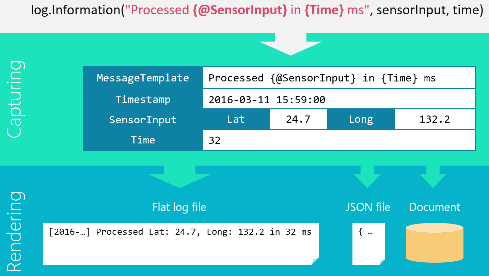
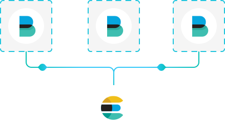

<!-- .slide: data-background="./resources/logging-background.jpg" -->

----

# 30 minutes of logging

* Structured logging
* Elastic Stack
* Examples

----

Typos? Suggestions? This presentation is on Github: [`elastic-structured-logging`](https://github.com/pardahlman/elastic-structured-logging)


---

# Logging scenarios

```cs
log.Info($"An exception occured {e.Message}.");
```

```
log.Info($"Operation completed in {s.TotalMilliSeconds} ms.");
```
<!-- .element: class="fragment" data-fragment-index="1" -->
```
log.Info($"User removed product {p.Id} from cart.");
```
<!-- .element: class="fragment" data-fragment-index="2" -->

_Implicit destruction of structured objects to human readable strings_
<!-- .element: class="fragment" data-fragment-index="3" -->

Note: Logging has multiple use cases, including (1) recording exceptions, (2) instrumentation/statistics (3) decision making

----
# Structured logging

>Logging is an emitted stream of distinct messages from a running application

* What is a message?
<!-- .element: class="fragment" data-fragment-index="1" -->
* Who is the recipiant?
<!-- .element: class="fragment" data-fragment-index="2" -->

Note: A message is not just any ol' line in an log file. A message can contain structured data and be written to multiple places.

----

## [Message templates](https://messagetemplates.org/)

A language-neutral specification for 1) capturing, and 2) rendering, structured log events in a format that’s both human-friendly and machine-readable.

Formalized syntax

```
log.Info("A message template with {hole}", holeValue);

log.Info("Formated hole {today:yyyy-MM-dd}", DateTime.Now);

log.Info("This one is {@destructed}", complexObj);
```

Note:  Many are used to render output to log files, but as the illustration shows it can be sinked to databases, files - but also Elasticsearch.

----

---

# The Elastic Stack

> _Elastic Stack_? I thought it was the _ELK Stack_?

Note: ELK refes to three open source projects, _Elasticsearch_,  _Logstash_ and _Kibana_. But as it  grew in popularity, so did the user cases and more application got developed. Since a few years back [the solution is simpliy called _Elastic Stack_](https://www.elastic.co/elk-stack) 

----


```json
{
  "cluster_name" : "docker-cluster",
  "version" : {
    "number" : "6.1.1",
    "build_hash" : "bd92e7f",
    "build_date" : "2017-12-17T20:23:25.338Z",
    "build_snapshot" : false,
    "lucene_version" : "7.1.0",
  },
  "tagline" : "You Know, for Search"
}
```

Note: Elasticsearch is a distributed, RESTful search and analytics engine.

----

# Logstash


<!-- .element: class="fragment" data-fragment-index="1" -->

_Logstash is an open source, server-side data processing pipeline that ingests data from a multitude of sources simultaneously, transforms it, and then sends it to a stash._
<!-- .element: class="fragment" data-fragment-index="2" -->

Note: Data processing pipeline that ingests data from a multitude of sources simultaneously, transforms it, and then sends it to a "stash" (e.g. Elasticsearch).

----

# Kibana


Note: The window into the Elastic Stack. Kibana give you a font end to the elastic indeces, but can also be used to visualize other data sources including time series
----

# Beats

 _Filebeast_, _Metricsbeat_, _Packetbeats_, _Winlogbeats_ and more are single-purpose data shippers.
 

---
Further reading:

* [messagetemplates.org](https://messagetemplates.org/)
* [blog post: structued logging](https://gregoryszorc.com/blog/2012/12/06/thoughts-on-logging---part-1---structured-logging/)
* [Elastic products](https://www.elastic.co/products)
* [Serilog](https://serilog.net/)

---

# Code

```
var presentation = Presentation.Current;
var example = new DotNetExample();

while(!presentation.TimeIsUp)
{
    example.Do();
}
```
